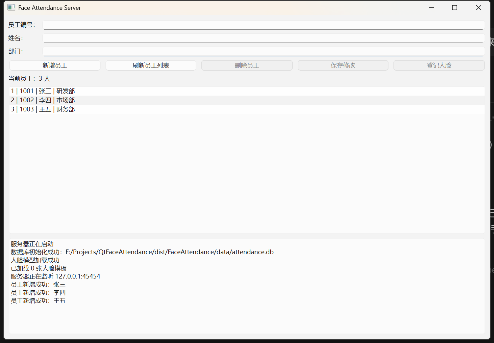
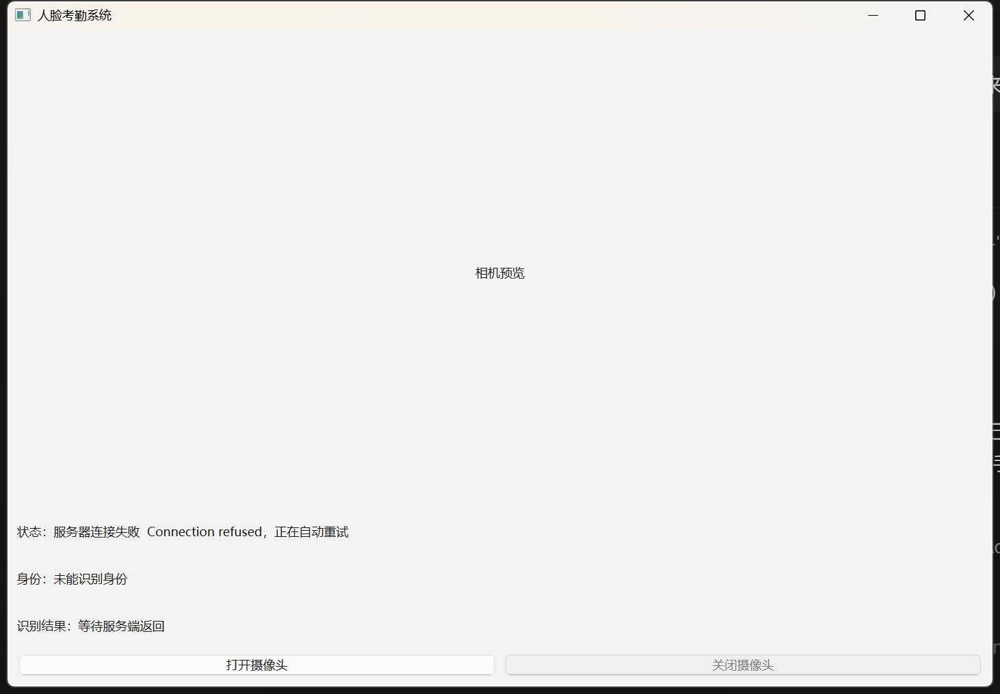
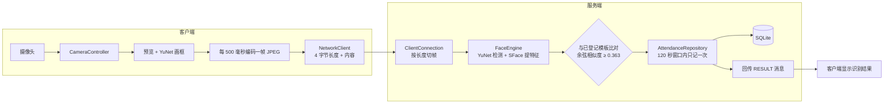

# 人脸考勤系统 QtFaceAttendance

用 Qt 6 和 C++ 实现的客户端 / 服务端人脸考勤系统。客户端负责采集摄像头画面并持续推流，
服务端负责人脸检测、特征提取和身份识别，识别成功后写入一条限流的考勤记录，并把结果
回传给客户端显示。

A client / server face attendance system built with Qt 6 and C++20. The client streams
camera frames; the server detects faces, extracts SFace embeddings, recognises employees
against stored templates, writes rate-limited attendance records, and reports the
outcome back to the client.





## 这个项目解决什么问题

传统考勤靠打卡机或者手机定位，前者要排队，后者可以找人代刷。人脸考勤想解决的是
"人到了才算"——摄像头看到的是本人的脸，而不是一张卡或者一个手机。

这个项目做的是一个可运行的最小闭环：

**员工录入 → 采集人脸模板 → 站在摄像头前 → 系统认出是谁 → 记一条考勤**

## 功能

| 功能 | 说明 |
| --- | --- |
| 员工管理 | 增、删、改、查，工号唯一，工号不允许修改 |
| 人脸登记 | 把当前画面里的人脸登记录入到某个员工名下，同一张脸不能登记给两个人 |
| 实时识别 | 客户端每 500 毫秒推一帧，服务端实时检测并比对已登记的人脸模板 |
| 考勤记录 | 识别成功写入一条考勤，同一个人 120 秒内只记一次 |
| 结果回传 | 服务端把识别结果和考勤结论发回客户端显示 |
| 自动重连 | 客户端断线后每 3 秒重试，服务端重启后能自己接回来 |

## 系统架构



两边各管一摊：

- **客户端**只做三件事：开摄像头、在本地画一个预览用的绿框、按固定间隔把画面推给服务端。
  它不认识数据库，也不知道"这是谁"。
- **服务端**承担所有判断：图像解码、人脸检测、特征提取、和数据库里的模板比对、
  写考勤、把结论回传。它同时管着界面和数据库。

这样分的理由是：**识别规则和数据库必须在一起**，否则"谁是谁"这件事要在两个进程里
各算一遍，还得保证两边结论一致。

## 关键设计决策

这几条是这个项目真正值得说的地方，也是面试里最容易被追问的部分。

### 1. 人脸识别放在服务端，客户端只推流

客户端把原始画面推上去，服务端做全部识别。

代价是原始人脸离开了用户这台电脑，而且带宽消耗大。另一种做法是客户端算好特征、
只把 128 个浮点数（512 字节）传上去，服务端只负责比对——带宽小两个数量级，
原始人脸也不出本机。之所以现在选服务端识别，是因为识别逻辑和数据库要在同一个进程里，
改动最小；客户端提特征那套作为后续优化项。

### 2. 系统里有两个阈值，管的是完全不同的事

| 阈值 | 数值 | 作用 | 调高的后果 | 调低的后果 |
| --- | --- | --- | --- | --- |
| 检测置信度 | 0.7 | 多确定算"这是一张脸" | 漏检，头一歪就找不到人 | 误检，把不是脸的框进来 |
| 余弦相似度 | 0.363 | 多像算"是同一个人" | 别人也能刷进你的账号 | 本人经常认不出来 |

检测阈值用的是 0.7 而不是模型默认的 0.9。实测同一张人脸偏转 15 度，0.9 时完全
检测不到，0.7 时能正常识别。识别阈值 0.363 是 SFace 官方给出的推荐值。

### 3. 推流按 500 毫秒抽样，不是每帧都发

预览定时器大约 30 毫秒触发一次。逐帧上传会把带宽和 CPU 打满，而人脸在半秒内不会
变成另一个人。所以上传按 500 毫秒抽样，本地预览仍然是流畅的。

### 4. 自己实现消息分帧

TCP 是字节流，没有消息边界：你写两次对方可能一次读到，你写一次对方可能分三次读到。
所以协议规定每条消息前面加 4 个字节的大端长度前缀。

切帧函数返回三种结果而不是真 / 假：**数据还没到齐**（继续等）、**切出一整帧**
（交给上层）、**长度字段不合法**（流已经错位，只能断开重连）。前两种都返回
假的话，调用方没法区分该等还是该断。

### 5. 日志按"状态"去重，不按显示文字去重

状态区只在识别结果变化时记一行。这里的去重键是"有没有脸、认出来没有、认出来的是谁"，
**不是那行文字**——因为文字里带着相似度，摄像头每一帧的相似度都在第四位小数上抖动，
拿文字当键等于没去重。

### 6. 考勤限流靠查数据库，不靠内存变量

"同一个人 120 秒内只记一次"这条规则是通过查询数据库里最近的记录实现的，而不是在
内存里存一个时间戳。好处是服务端重启之后规则依然生效。时间比较整个交给数据库做，
因为 `created_at` 存的是 UTC，用本地时间去比会差 8 小时。

### 7. 一张脸只能属于一个工号

登记人脸时会拿新脸和**除本人以外**的所有模板比对，只要有超过识别阈值的就拒绝登记。

这条规则如果缺失，后果比"多了一条数据"严重得多：同一个人的脸挂在两个工号下面，
考勤可能记到错的人头上，而两条记录看起来都完全正常，事后无法分辨。本人重新登记
是允许的，那是正常的模板更新。

## 技术栈

| 技术 | 版本 | 用在哪 |
| --- | --- | --- |
| Qt | 6.9.1 (MSVC 2022 64-bit) | 界面、网络、数据库、定时器 |
| C++ | C++20 | 全部业务代码 |
| OpenCV | 4.12.0 | 摄像头采集、图像处理、人脸检测与识别 |
| YuNet | `face_detection_yunet_2023mar.onnx` | 人脸检测（输出框和 5 个关键点） |
| SFace | `face_recognition_sface_2021dec.onnx` | 提取 128 维人脸特征向量 |
| SQLite | Qt 内置 QSQLITE 驱动 | 员工、人脸模板、考勤记录 |
| CMake | 3.24+ | 构建 |

## 目录结构

```
apps/client/       客户端：摄像头、本地预览、推流、界面
apps/server/       服务端：识别、考勤、员工管理、界面
common/            两端共用：消息分帧协议
tests/             自动化测试：协议 + 数据库
assets/            人脸模型文件
docs/              进度记录、排错手册、打包说明、界面截图
```

## 怎么构建

需要先装好：

- Windows 10 或 11
- Visual Studio 2022，并且勾选"使用 C++ 的桌面开发"
- Qt 6.9.1 for MSVC 2022 64-bit
- CMake 3.24 或更新
- OpenCV 4.12.0（路径需要让 CMake 能找到，设置 `OpenCV_DIR`）

```powershell
cmake -S . -B build -G "Visual Studio 17 2022" -A x64 `
  -DCMAKE_PREFIX_PATH=E:/Dev/Qt/6.9.1/msvc2022_64
cmake --build build --config Release --parallel
```

`CMAKE_PREFIX_PATH` 用来告诉 CMake 你的 Qt 装在哪里，路径按自己的实际情况改。

模型文件在 `assets/` 里，构建时会被自动复制到 exe 旁边，不需要手工操作。

## 怎么运行

**先启动服务端，再启动客户端。** 客户端连不上会自动重试，所以顺序反了也不会卡死。

服务端启动后状态区会依次显示：

```
数据库初始化成功
人脸模型加载成功
已加载 N 张人脸模板
服务器正在监听 127.0.0.1:45454
```

然后按这个顺序操作：

1. 在服务端填工号、姓名、部门，点"新增员工"
2. 客户端点"打开摄像头"
3. 在服务端列表里选中这个员工，点"登记人脸"——登记的是客户端最近送来的那一帧
4. 之后站在摄像头前，服务端会显示"识别成功：某某，相似度 0.8xxx"，客户端会显示
   "某某 · 考勤已记录：签到"
5. 走开两分钟内再回来，会显示"考勤未记录：120 秒内已经记过一次"

## 测试

```powershell
ctest --test-dir build -C Release --output-on-failure
```

目前覆盖两块：

- **协议层 5 个用例**：长度前缀的打包、完整帧、只到一半、两条粘在一起、长度非法
- **数据库层 7 个用例**：建表、增查、工号重复、更新、级联删除、限流命中、
  超出窗口的记录不算

"两条粘在一起"和"只到一半"是 TCP 的常态而不是异常，所以专门写了用例。

## 打包

打包成"拷到别人电脑上就能运行"的文件夹，步骤和每一步的原因见
[docs/PACKAGING.md](docs/PACKAGING.md)。

成品约 154 MB（OpenCV 61 MB、Qt 图形栈 27 MB、软件 OpenGL 兜底 20 MB、模型 37 MB）。

## 已知限制

诚实地列在这里，避免把这个项目说得比实际更强：

- **没有活体检测**：拿一张本人的照片对着摄像头也能刷上，真正的考勤系统必须解决这个问题
- **只有签到，没有签退**：签退需要时间段规则，目前没做
- **识别阈值没有按实际环境调优**：0.363 是模型的推荐值，实际部署前应该用真实摄像头
  采集的数据重新标定
- **原始人脸会上传到服务端**：局域网演示可以接受，实际部署应该改成客户端提特征
- **分帧没有超时**：如果对方发一个长度合法但内容只发一半的包，服务端会一直等下去
- **多客户端没有实测**：协议和代码支持多连接，但没有验证过两个人同时刷

## 文档

| 文档 | 内容 |
| --- | --- |
| [docs/PROGRESS.md](docs/PROGRESS.md) | 开发进度、每天做了什么、验证到什么程度 |
| [docs/TROUBLESHOOTING.md](docs/TROUBLESHOOTING.md) | 踩过的每一个坑：现象、原因、处理、怎么避免 |
| [docs/PACKAGING.md](docs/PACKAGING.md) | 打包步骤，以及为什么每一步都要这么做 |

## 来源与许可

这个项目是基于一份经授权的教育用途源码重建的。原始源码作为学习参考，
本仓库的架构和实现是重新编写的。

> The project is based on educational source code shared with permission. The original
> source is used as a learning reference; the architecture and implementation in this
> repository are rewritten.

项目中使用的第三方库和人脸模型来自公开渠道：

| 内容 | 来源 | 用途 |
| --- | --- | --- |
| Qt 6 | qt.io | 界面、网络、数据库 |
| OpenCV 4.12 | opencv.org | 图像处理 |
| YuNet 模型 | OpenCV Zoo | 人脸检测 |
| SFace 模型 | OpenCV Zoo | 人脸特征提取 |

部署给第三方之前，请自行确认上述各组件的许可证条款。

## 开发说明

这个项目是按一份 15 天的计划做出来的，从装 Qt 开始，到能打包给别人运行。
每天的进度和验证结果记录在 [docs/PROGRESS.md](docs/PROGRESS.md) 里，
过程中踩过的坑记录在 [docs/TROUBLESHOOTING.md](docs/TROUBLESHOOTING.md)。
